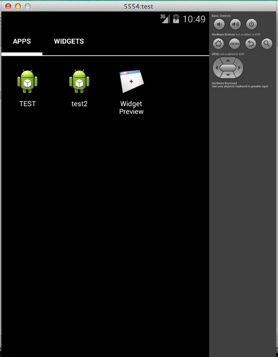
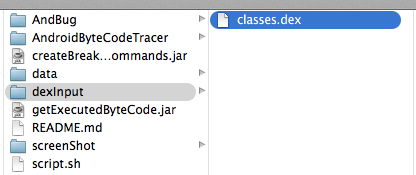
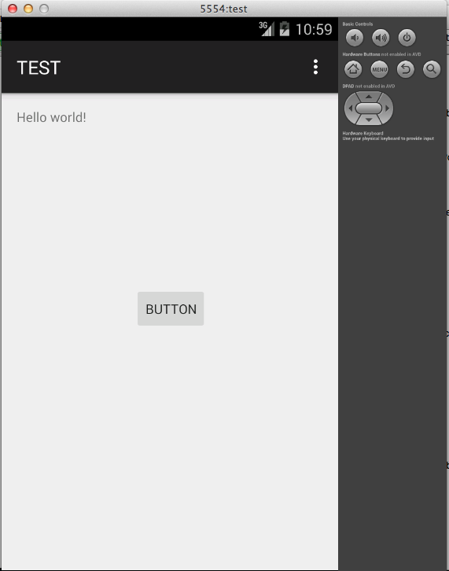
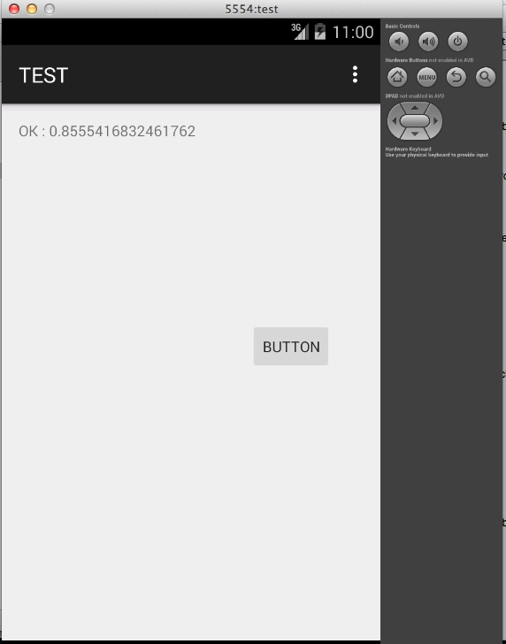
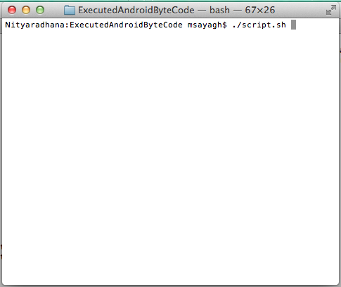
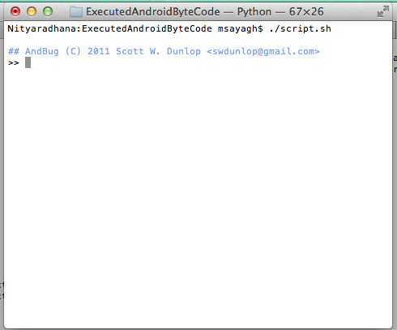
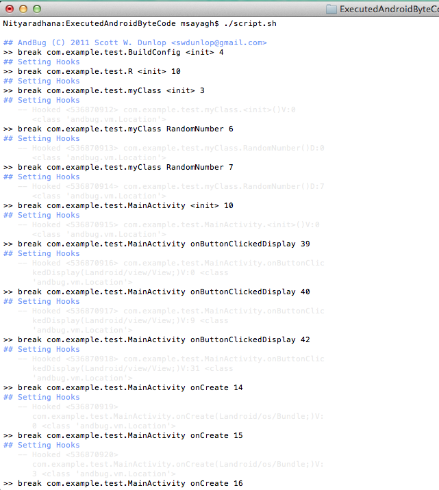
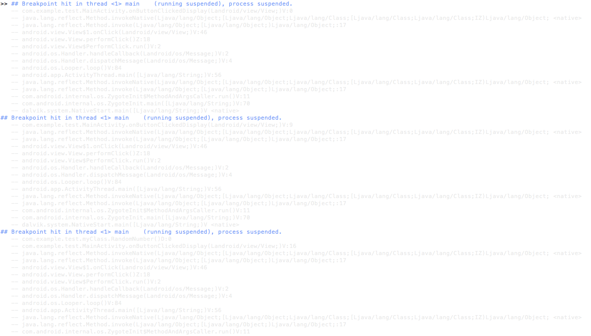
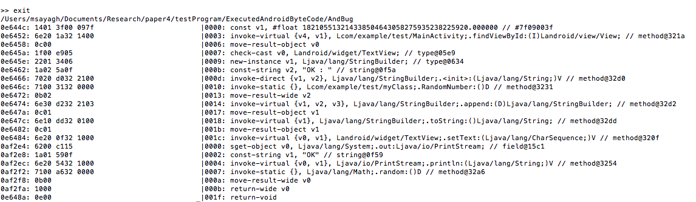

# ExecutedAndroidByteCode

ExecutedAndroidByteCode is a tool helping to get executed Android byte code. It uses the debugger AndBug. 

## Installation:

1. git clone git@github.com:msayagh/ExecutedAndroidByteCode.git

2. Make sure you have python 2 installed, and go to AndBug folder, and compile it:

make

3. Go back to the root folder.

## How to configure:

Open script.sh, and modify the variables "programName" and "androidSDK".

## How to use it:

1. Open your Android emulator and install your app.

2. Make sure that no debugger is connected to the emulator (like eclipse).

3. Get your dex file and put it in the dexInput folder.

4. Execute your tests in order to load the classes where the script.sh is going to add debug breakpoints.

5. From command line go to ExecutedAndroidByteCode folder and execute script.sh.

6. The program is going to generate some commands in the commandsToInsertBreakPoints.txt file. Open it and copy paste these commands in the command line. 

7. Copy paste the commands result in data/BreakPointsHook.txt.

8. Execute your tests again (what you executed in step 4), some results will be generated in the command line.

9. Copy paste them in the data/traces.txt.

10. Type "exit" in the command line, and get the executed byte code.

## Example:

1. Open your Android emulator and install your app.

I installed the app "test". It is an application that generates a random number after a click on a button.

2. Make sure that no debugger is connected to the emulator (like eclipse). 

I closed eclipse.

3. Copy past your dex file in dexInput folder:

4. Execute your tests in order to load the classes where the script.sh is going to add debug breakpoints.

Open the application: 

Execute your tests: I click on the button: 

5. From command line go to ExecutedAndroidByteCode folder and execute script.sh.

It is going to take few seconds to minutes depending on the dex file size, until you get a result like :

6. The program is going to generate some commands in the commandsToInsertBreakPoints.txt file. Open it and copy paste these commands in the command line. 

Once you get the previous screen, you will find some commands generated in the file "commandsToInsertBreakPoints.txt". Copy paste them like the following: 

7. Copy paste the commands result in data/BreakPointsHook.txt. From the line "## AndBug (C) 2011 Scott W. Dunlop <swdunlop@gmail.com>" to the last line, like the example you have in the file data/BreakPointsHook.txt.

8. Execute your tests again (what you executed in step 4), some results will be generated in the command line, like :

9. Copy paste these results in the data/traces.txt file, from the first "## Breakpoint hit in ....." without copying ">>", to the last line.

10. Click enter, and type "exit" in the command line, and get the executed byte code, after a short while, like the following : 

